# Tienda

Mapa de dependencias de la carpeta lib y plan de migración seguro.

## 1. Resumen ejecutivo

La arquitectura actual está organizada en capas claras:

- Capa de entrada: main.dart y rutas de la app.
- Capa de presentación: vistas, widgets y hooks.
- Capa de control: controllers y providers de contexto.
- Capa de servicios: DatabaseService, AuthService, AnalyticsService, procesos de background y mantenimiento.
- Capa de persistencia: SQLite a través de DatabaseService y helpers de plataforma.

El punto central del sistema es DatabaseService, que concentra la mayor parte del acceso a SQLite y actúa como dependencia transversal para controladores, providers y servicios.

## 2. Archivos que llaman a DatabaseService

Estos archivos consumen directamente DatabaseService:

- lib/main.dart
- lib/Presentation/admin/AdminDBPage.dart
- lib/Presentation/Context/customer_provider.dart
- lib/Presentation/Context/inventory_provider.dart
- lib/Presentation/Context/product_provider.dart
- lib/Presentation/Context/purchase_provider.dart
- lib/Presentation/Context/reports_provider.dart
- lib/Presentation/Context/sale_provider.dart
- lib/Presentation/Controller/cash_controller.dart
- lib/Presentation/Controller/customers_controller.dart
- lib/Presentation/Controller/inventory_controller.dart
- lib/Presentation/Controller/pos_controller.dart
- lib/Presentation/Controller/product_management_controller.dart
- lib/Presentation/Controller/purchases_controller.dart
- lib/Presentation/Controller/reports_controller.dart
- lib/Presentation/Controller/suppliers_controller.dart
- lib/Presentation/Controller/users_controller.dart
- lib/Presentation/display/database_initializer_native.dart
- lib/Presentation/Services/analytics_service.dart
- lib/Presentation/Services/auth_service.dart
- lib/Presentation/Services/background_job_service.dart
- lib/Presentation/Services/database_maintenance_service.dart
- lib/Presentation/Services/database_service.dart

### Observación importante

La mayoría de los módulos de negocio no acceden a SQLite de forma directa; usan DatabaseService como capa de abstracción. Esto facilita una migración incremental sin romper toda la app de una vez.

## 3. Archivos que usan SQLite

### Uso directo de SQLite

Archivos que interactúan directamente con SQLite o con APIs de sqflite:

- lib/Presentation/Services/database_service.dart
- lib/Presentation/Services/database_location_service.dart
- lib/Presentation/Services/database_maintenance_service.dart
- lib/Presentation/Services/analytics_service.dart
- lib/Presentation/Services/background_job_service.dart
- lib/Presentation/Services/auth_service.dart
- lib/Presentation/admin/AdminDBPage.dart

### Uso indirecto a través de DatabaseService

Archivos que no usan SQL directo, pero dependen de funciones expuestas por DatabaseService:

- lib/Presentation/Controller/cash_controller.dart
- lib/Presentation/Controller/customers_controller.dart
- lib/Presentation/Controller/inventory_controller.dart
- lib/Presentation/Controller/pos_controller.dart
- lib/Presentation/Controller/product_management_controller.dart
- lib/Presentation/Controller/purchases_controller.dart
- lib/Presentation/Controller/reports_controller.dart
- lib/Presentation/Controller/suppliers_controller.dart
- lib/Presentation/Controller/users_controller.dart
- lib/Presentation/Context/customer_provider.dart
- lib/Presentation/Context/inventory_provider.dart
- lib/Presentation/Context/product_provider.dart
- lib/Presentation/Context/purchase_provider.dart
- lib/Presentation/Context/reports_provider.dart
- lib/Presentation/Context/sale_provider.dart
- lib/Presentation/Services/analytics_service.dart
- lib/Presentation/Services/background_job_service.dart
- lib/Presentation/Services/database_maintenance_service.dart

## 4. Archivos que usan Providers

Los providers están usados como capa de estado para la UI y para coordinar los controladores.

### Definición central de providers

- lib/Presentation/Context/providers.dart
- lib/Presentation/Context/analytics_provider.dart
- lib/Presentation/Context/customer_provider.dart
- lib/Presentation/Context/inventory_provider.dart
- lib/Presentation/Context/pos_sale_provider.dart
- lib/Presentation/Context/product_provider.dart
- lib/Presentation/Context/purchase_provider.dart
- lib/Presentation/Context/reports_provider.dart
- lib/Presentation/Context/sale_provider.dart
- lib/Presentation/Controller/auth_provider.dart

### Registro en la app

- lib/main.dart
- lib/Presentation/View/POS/pos_view.dart

### Consumo desde vistas y widgets

- lib/Presentation/View/Cash/cash_view.dart
- lib/Presentation/View/Customers/customers_view.dart
- lib/Presentation/View/Inventory/inventory_view.dart
- lib/Presentation/View/POS/pos_view.dart
- lib/Presentation/View/Product/product_management_view.dart
- lib/Presentation/View/Purchases/purchases_view.dart
- lib/Presentation/View/Reports/reports_view.dart
- lib/Presentation/View/Suppliers/suppliers_view.dart
- lib/Presentation/View/Users/cajeros_view.dart
- lib/Presentation/View/Users/users_view.dart
- lib/Presentation/Widgets/POS/pos_client_search_dialog.dart
- lib/Presentation/Widgets/POS/pos_cliente_section.dart
- lib/Presentation/Widgets/POS/pos_forma_pago_section.dart
- lib/Presentation/Widgets/POS/pos_pagos_recibidos_section.dart
- lib/Presentation/Widgets/POS/pos_product_search_dialog.dart
- lib/Presentation/Widgets/POS/pos_productos_section.dart
- lib/Presentation/Widgets/POS/pos_receipt_type_card.dart
- lib/Presentation/Widgets/POS/pos_resumen_venta_card.dart
- lib/Presentation/Widgets/POS/pos_sales_history_tab.dart

## 5. Árbol de dependencias

### Visión de capas

```mermaid
flowchart TD
    A[main.dart] --> B[AuthProvider]
    A --> C[ProductManagementController]
    A --> D[CashController]
    A --> E[PosController]
    A --> F[PurchasesController]
    A --> G[CustomersController]
    A --> H[ReportsController]
    A --> I[AppProviders]

    I --> J[ProductProvider]
    I --> K[CustomerProvider]
    I --> L[SaleProvider]
    I --> M[PurchaseProvider]
    I --> N[InventoryProvider]
    I --> O[ReportsProvider]
    I --> P[UsersController]
    I --> Q[SuppliersController]
    I --> R[AnalyticsProvider]

    J --> S[DatabaseService]
    K --> S
    L --> S
    M --> S
    N --> S
    O --> S
    P --> S
    Q --> S
    R --> S

    C --> S
    D --> S
    E --> S
    F --> S
    G --> S
    H --> S

    T[Views / Widgets] --> U[Controllers / Providers]
    U --> S

    V[AuthService] --> S
    W[BackgroundJobService] --> S
    X[DatabaseMaintenanceService] --> S
    Y[AnalyticsService] --> S
    Z[DatabaseInitializer] --> S
```



### Dependencias por módulo

```text
main.dart
├── inicializa plataforma y base de datos
├── registra Providers y Controllers
├── inicia BackgroundJobService y DatabaseMaintenanceService
└── carga AuthService para sesión

Views / Widgets
├── usan Controllers o Providers
├── los Controllers/Providers consultan DatabaseService
└── la persistencia se resuelve en la capa de servicios

Controllers
├── CashController
├── CustomersController
├── InventoryController
├── PosController
├── ProductManagementController
├── PurchasesController
├── ReportsController
├── SuppliersController
├── UsersController
└── cada uno depende de DatabaseService o de servicios que lo encapsulan

Context Providers
├── ProductProvider
├── CustomerProvider
├── SaleProvider
├── PurchaseProvider
├── InventoryProvider
├── ReportsProvider
├── AnalyticsProvider
└── todos consumen DatabaseService para cargar/guardar datos

Services
├── DatabaseService (núcleo SQLite)
├── AuthService
├── AnalyticsService
├── BackgroundJobService
├── DatabaseMaintenanceService
├── DatabaseLocationService
└── DatabaseInitializer
```

## 6. Dependencias críticas a tener en cuenta para la migración

### Núcleo de riesgo alto

- DatabaseService es el punto de entrada más importante para persistencia.
- Los Controllers y Providers dependen directamente de él y no deben cambiarse todos a la vez.
- La app usa Provider para flujo de UI y estado, por lo que cualquier cambio de persistencia debe conservar el contrato de los objetos y los métodos públicos.

### Riesgo medio

- Servicios como AuthService, BackgroundJobService y AnalyticsService también acceden a la base de datos y pueden ser afectados si se cambia el backend.
- Las vistas y widgets consumen state providers, por lo que deben seguir recibiendo la misma interfaz de datos.

## 7. Plan de migración seguro y compilable por fases

La regla principal es no romper la app. Cada fase debe ser funcional y compilable.

### Fase 0 — Baseline y guardrails

Objetivo: dejar el proyecto en un estado estable antes de tocar lógica de persistencia.

Acciones:

- documentar el mapa actual de dependencias.
- identificar puntos de entrada de base de datos.
- asegurar que la app compila y corre con el estado actual.
- no cambiar contratos públicos de DatabaseService todavía.

Resultado esperado:

- la app sigue funcionando.
- el proyecto queda como referencia para migraciones futuras.

### Fase 1 — Crear una capa de abstracción de persistencia

Objetivo: introducir un contrato de persistencia sin cambiar el comportamiento de la app.

Acciones:

- crear una interfaz o contrato de persistencia con métodos como getProducts, createProduct, getSalesHistory, etc.
- implementar una clase adaptadora que envuelva a DatabaseService.
- mantener DatabaseService como implementación actual.
- dejar que los controladores sigan llamando al mismo API de forma compatible.

Regla de seguridad:

- no cambiar todos los módulos a la vez.
- no eliminar métodos viejos hasta que el adaptador los soporte.

Resultado esperado:

- la app sigue compilando.
- el nuevo contrato existe, pero sigue usando SQLite por debajo.

### Fase 2 — Migrar módulos de baja complejidad

Objetivo: mover primero los módulos con menos dependencia entre capas.

Módulos recomendados:

- AuthService
- UsersController / SuppliersController
- partes de reporting y catálogo simple

Acciones:

- cambiar estos módulos para usar el contrato de persistencia nuevo.
- mantener el adaptador de DatabaseService como implementación por defecto.
- validar que la UI sigue funcionando tras cada cambio.

Resultado esperado:

- los módulos más simples ya no dependen directamente de DatabaseService.
- el proyecto sigue compilando tras cada mini-cambio.

### Fase 3 — Migrar módulos de negocio intermedios

Objetivo: mover módulos de negocio de forma incremental, uno por uno.

Módulos recomendados:

- ProductProvider / ProductManagementController
- CustomerProvider / CustomersController
- InventoryProvider / InventoryController

Acciones:

- migrar una familia de archivos por iteración.
- no modificar vistas ni widgets en la misma fase si no es necesario.
- mantener compatibilidad con los métodos existentes del adaptador.

Resultado esperado:

- cada módulo se migra sin afectar el resto del sistema.
- las vistas siguen operando con la misma interfaz de datos.

### Fase 4 — Migrar módulos de ventas y caja

Objetivo: cubrir el flujo crítico de POS, ventas, pagos y caja.

Módulos recomendados:

- PosController
- SaleProvider
- PurchaseProvider / PurchasesController
- CashController

Acciones:

- migrar primero el acceso a datos del controlador y luego los providers.
- evitar cambios grandes en la UI.
- priorizar compatibilidad con el estado actual del carrito, pagos y sesiones de caja.

Resultado esperado:

- el flujo de POS sigue funcionando.
- la migración no obliga a reescribir toda la interfaz de usuario.

### Fase 5 — Introducir un backend alternativo o nuevo motor de persistencia

Objetivo: permitir cambiar el motor subyacente manteniendo el contrato visible del sistema.

Acciones:

- implementar una segunda clase adaptadora que use un nuevo backend.
- dejar el cambio activable por configuración o feature flag.
- mantener DatabaseService como fallback de seguridad.

Regla de seguridad:

- el sistema debe poder volver a la implementación anterior sin reescribir la app.

Resultado esperado:

- la app puede cambiar de backend sin romper la arquitectura existente.

### Fase 6 — Limpieza y eliminación gradual de compatibilidad antigua

Objetivo: remover el código legado cuando la nueva capa haya demostrado estabilidad.

Acciones:

- eliminar el uso directo de DatabaseService en los módulos ya migrados.
- quitar métodos obsoletos solo cuando ya no haya referencias.
- mantener pruebas de compilación y ejecución después de cada limpieza.

Resultado esperado:

- el sistema queda más limpio, modular y menos acoplado a SQLite.

## 8. Reglas de oro para no romper la app

1. Nunca migrar más de un dominio funcional por cambio grande.
2. Mantener los métodos públicos de DatabaseService compatibles durante las primeras fases.
3. Hacer cambios pequeños, validar y avanzar.
4. Preferir un adaptador intermedio antes que reescribir controladores y vistas directamente.
5. Si un cambio toca más de un archivo, hacerlo en pasos pequeños y comprobables.
6. Mantener al menos un camino de ejecución funcional en cada fase.

## 9. Recomendación práctica

La estrategia más segura es:

- crear la capa de abstracción primero,
- migrar servicios y controladores de baja complejidad,
- luego mover providers y módulos de negocio,
- y solo después introducir un backend alternativo si se requiere.

Este enfoque permite evolucionar el proyecto sin perder estabilidad ni hacer una migración monolítica.
